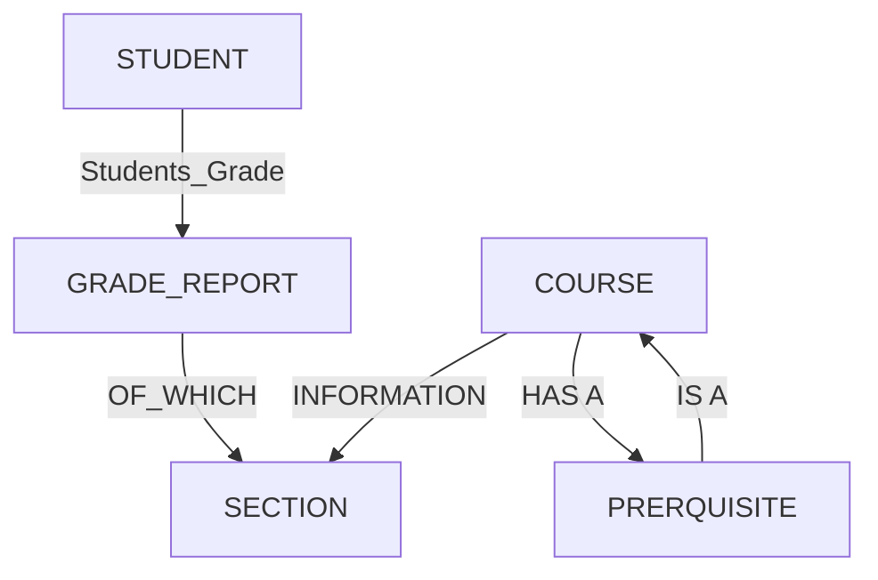
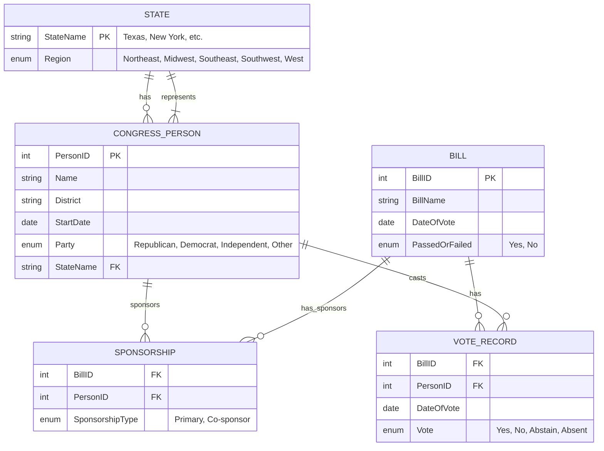
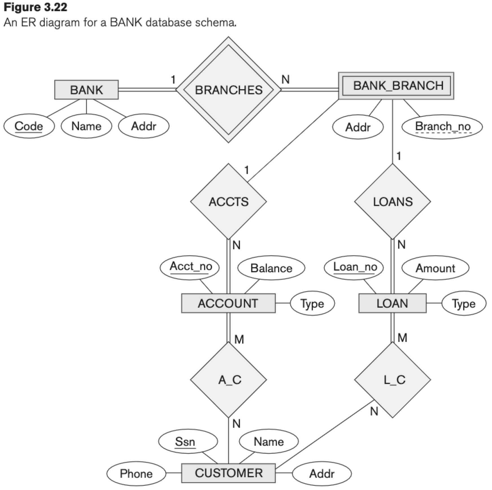
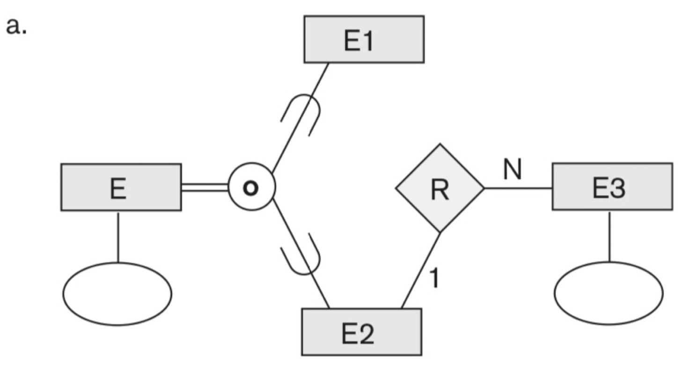
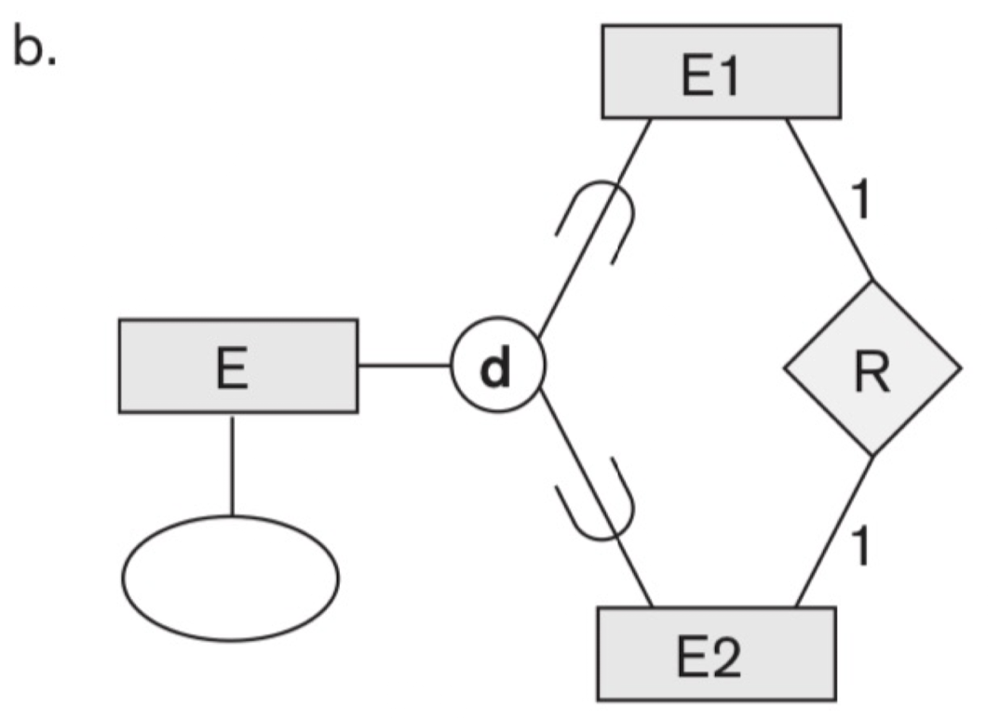
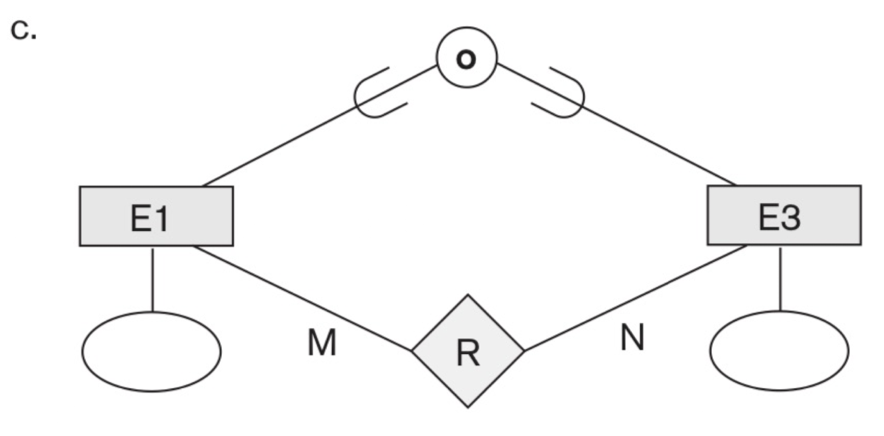

# Database Systems Homework 01

> NTUST Course Project  
> Course No: `CS3010301`  
> Course Name: Database Systems  
> Author: Hayden Chang 張皓鈞 B11030202  
> Email: B11030202@mail.ntust.edu.tw

## 1. Exercise 1.10

### Question

**Specify all the relationships among the records of the database shown in Figure 1.2.**

#### STUDENT

| Name  | Student_number | Class | Major |
| ----- | -------------- | ----- | ----- |
| Smith | 17             | 1     | CS    |
| Brown | 8              | 2     | CS    |

#### COURSE

| Course_name               | Course_number | Credit_hours | Department |
| ------------------------- | ------------- | ------------ | ---------- |
| Intro to Computer Science | CS1310        | 4            | CS         |
| Data Structures           | CS3320        | 4            | CS         |
| Discrete Mathematics      | MATH2410      | 3            | MATH       |
| Database                  | CS3380        | 3            | CS         |

#### SECTION

| Section_identifier | Course_number | Semester | Year | Instructor |
| ------------------ | ------------- | -------- | ---- | ---------- |
| 85                 | MATH2410      | Fall     | 07   | King       |
| 92                 | CS1310        | Fall     | 07   | Anderson   |
| 102                | CS3320        | Spring   | 08   | Knuth      |
| 112                | MATH2410      | Fall     | 08   | Chang      |
| 119                | CS1310        | Fall     | 08   | Anderson   |
| 135                | CS3380        | Fall     | 08   | Stone      |

#### GRADE_REPORT

| Student_number | Section_identifier | Grade |
| -------------- | ------------------ | ----- |
| 17             | 112                | B     |
| 17             | 119                | C     |
| 8              | 85                 | A     |
| 8              | 92                 | A     |
| 8              | 102                | B     |
| 8              | 135                | A     |

#### PREREQUISITE

| Course_number | Prerequisite_number |
| ------------- | ------------------- |
| CS3380        | CS3320              |
| CS3380        | MATH2410            |
| CS3320        | CS1310              |

### Answer

## 2. Exercise 3.21

### Question

Design an ER schema for keeping track of information about votes taken in the U.S. House of Representatives during the current two-year congress-ional session. The database needs to keep track of each U.S. STATEʼs Name(e.g., `Texas`, `New York`, `California`) and include the Region of the state (whose domain is `{'Northeast', 'Midwest', 'Southeast', 'Southwest', 'West'}`). Each `CONGRESS_PERSON` in the House of Representatives is described by his or her Name, plus the District represented, the Start_date when the congressperson was first elected, and the political Party to which he or she belongs (whose domain is `{'Republican', 'Democrat', 'Independent', 'Other'}`). The database keeps track of each BILL (i.e., proposed law), including the `Bill_name`, the `Date_of_vote` on the bill, whether the bill `Passed_or_failed` (whose domain is `{'Yes', 'No'}`), and the Sponsor (the congressperson(s) who sponsored—that is, proposed—the bill). The data-base also keeps track of how each congressperson voted on each bill (domain of Vote attribute is `{'Yes', 'No', 'Abstain', 'Absent'}`). **Draw an ER schema tion. State clearly any assumptions you make.**

### Answer

## 3. Exercise 3.23

### Question

Consider the ER diagram shown in Figure 3.22 for part of a BANK database. Each bank can have multiple branches, and each branch can have multiple accounts and loans.

- a. List the strong (nonweak) entity types in the ER diagram.
- b. Is there a weak entity type? If so, give its name, partial key, and identify-ing relationship.
- c. What constraints do the partial key and the identifying relationship of the weak entity type specify in this diagram?
- d. List the names of all relationship types, and specify the (min, max) constraint on each participation of an entity type in a relationship type. Justify your choices.
- e. List concisely the user requirements that led to this ER schema design.
- f. Suppose that every customer must have at least one account but is restricted to at most two loans at a time, and that a bank branch cannot have more than 1,000 loans. How does this show up on the (min, max) constraints?

### Answer

- a. BANK, ACCOUNT, CUSTOMER, LOAN
- b. Yes
  - name: BANK_BRANCH Partial
  - Key: Branch_no
  - Identifying Relationship: BRANCHES
- c.
  - Cardinality: ONE – to – many
  - Participation Constraint: Total participation
- d.
  - BRANCHES: (1, N) to BANK; (1,1) to BANK_BRANCH
  - ACCTS: (0, N) to BANK_BRANCH; (1, 1) to ACCOUNT
  - LOANS: (0, N) to BANK_BRANCH; (1, 1) to LOAN
  - A_C: (1, N) TO ACCOUNT; (0, N) TO COSTOMER
  - L_C: (1, N) TO LOAN; (0, N) TO COSTOMER
- e.
  - Bank has Name, Addr, Code(unique). BANKS have multiple branches
  - BANK_BRANCHES has Addr, Branch_no(unique). Branch have multiple accounts and loans
  - LOAN has Loan_no(unique), Amount, Type
  - COSTUMER has a SSN(unique), Name, Address, Phone
- f.
  - LOANS(0, 1000) TO BANK_BRANCH
  - A_C(1, N) TO CUSTOMER
  - L_C(0, 2) TO CUSTOMER

## 4. Exercise 4.20

### Question

Design a database to keep track of information for an art museum. Assume that the following requirements were collected:

- The museum has a collection of ART_OBJECTS. Each ART_OBJECT has a unique Id_no, an Artist (if known), a Year (when it was created, if k nown), a Title, and a Description. The art objects are categorized in several ways, as discussed below.
- ART_OBJECTS are categorized based on their type. There are three main types—PAINTING,
SCULPTURE, and STATUE—plus another type called OTHER to accommodate objects that do not fall into one of the three main types.
- A PAINTING has a Paint_type (oil, watercolor, etc.), material on which it is Drawn_on (paper,
  canvas, wood, etc.), and Style (modern, abstract, etc.).
- A SCULPTURE or a statue has a Material from which it was created (wood, stone, etc.),
  Height, Weight, and Style.
- An art object in the OTHER category has a Type (print, photo, etc.) and Style.
- ART_OBJECTs are categorized as either PERMANENT_COLLECTION(objects that are owned by the museum) and BORROWED. Information captured about objects in the PERMANENT_COLLECTION includes Date_acquired, Status (on display, on loan, or stored), and Cost. Information captured about BORROWED objects includes the Collection from which it was borrowed, Date_borrowed, and Date_returned.
- Information describing the country or culture of Origin (Italian, Egyptian, American, Indian, and so forth) and Epoch (Renaissance, Modern, Ancient, and so forth) is captured for each ART_OBJECT.
- The museum keeps track of ARTIST information, if known: Name, DateBorn (if known), Date_died (if not living), Country_of_origin, Epoch, Main_style, and Description. The Name is assumed to be unique.
- Different EXHIBITIONS occur, each having a Name, Start_date, and End_date. EXHIBITIONS are related to all the art objects that were on display during the exhibition.
- Information is kept on other COLLECTIONS with which the museum interacts; this information includes Name (unique), Type (museum, per-sonal, etc.), Description, Address, Phone, and current Contact_person.

**Draw an EER schema diagram for this application. Discuss any assumptions you make, and then justify your EER design choices.**

### Answer

## 5. Exercise 4.26

### Question

**Which of the following EERdiagrams is/are incorrect and why? State clearly any assumptions you make.**

### Answer

C, there isn't a entity of E1 and E3.