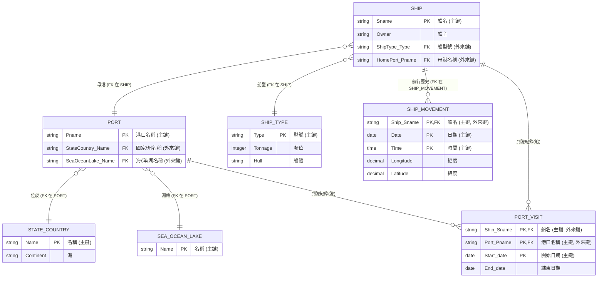

# Database Systems Homework 02

> NTUST Course Project  
> Course No: `CS3010301`  
> Course Name: Database Systems  
> Author: Hayden Chang 張皓鈞 B11030202  
> Email: B11030202@mail.ntust.edu.tw

## 1. Exercise 5.12

### Question

Consider the AIRLINE relational database schema shown in Figure 5.8, which describes a database for airline flight information. Each FLIGHT is identified by a Flight number, and consists of one or more FLIGHT_LEGs with Leg_numbers 1, 2, 3, and so on. Each FLIGHT_LEG has scheduled arrival and departure times, airports, and one or more LEG_INSTANCEs— one for each Date on which the flight travels. FAREs are kept for each FLIGHT. For each FLIGHT_LEG instance, SEAT_RESERVATIONs are kept, as are the AIRPLANE used on the leg and the actual arrival and departure times and airports. An AIRPLANE is identified by an Airplane_id and is of a particular AIRPLANE_TYPE. CAN_LAND relates AIRPLANE_TYPEs to the AIRPORTs at which they can land. An AIRPORT is identified by an Airport_code. Consider an update for the AIRLINE database to introduce a new leg instance tuple in the LEG_INSTANCE relation.

- **a.** Give the operations for this update.
- **b.** What types of constraints would you expect to check?
- **c.** Which integrity constraints should be checked to insert a new flight leg tuple into the FLIGHT_LEG relation not?
- **d.** Specify all the referential integrity constraints that hold on the schema shown in Figure 5.8.


### Answer

#### a. Give the operations for this update

- **操作：** 需要執行一個 `INSERT` 操作（例如 SQL 的 `INSERT INTO` 語句）。

- **細節：** 這個操作需要提供新航段實例的所有屬性值，包括：

  - `Flight_number` (航班號)
  - `Leg_number` (航段號)
  - `Date` (日期)
  - `Number_of_available_seats` (可用座位數)
  - `Airplane_id` (飛機 ID)
  - `Departure_airport_code` (實際出發機場代碼)
  - `Departure_time` (實際出發時間)
  - `Arrival_airport_code` (實際到達機場代碼)
  - `Arrival_time` (實際到達時間)

  例如 (SQL 語法示意):

  ```sql
  INSERT INTO LEG_INSTANCE (Flight_number, Leg_number, Date, Number_of_available_seats, Airplane_id, Departure_airport_code, Departure_time, Arrival_airport_code, Arrival_time)
  VALUES (value1, value2, value3, value4, value5, value6, value7, value8, value9);
  ```

#### b. What types of constraints would you expect to check?

在插入新的 `LEG_INSTANCE` 記錄時，需要檢查以下幾種類型的約束：

1. **域約束 (Domain Constraints):** 確保每個提供的值都符合其對應屬性的資料類型和格式（例如，`Date` 必須是有效的日期格式，`Number_of_available_seats` 必須是數字）。

2. **鍵約束 (Key Constraints):** `LEG_INSTANCE` 的主鍵是 (`Flight_number`, `Leg_number`, `Date`) 的組合。必須檢查新插入的記錄的這個組合值是否在表中已經存在，以確保主鍵的唯一性。

3. **實體完整性約束 (Entity Integrity Constraint):** 主鍵的任何部分 (`Flight_number`, `Leg_number`, `Date`) 都不能是 NULL。

4. 引用完整性約束 (Referential Integrity Constraints / Foreign Key Constraints):

   - 新記錄的 (`Flight_number`, `Leg_number`) 組合必須在 `FLIGHT_LEG` 表中存在（即，這個實例必須屬於一個已定義的航段）。
   - 新記錄的 `Airplane_id` 必須在 `AIRPLANE` 表中存在（即，使用的飛機必須是資料庫中已有的飛機）。
   - 新記錄的 `Departure_airport_code` 必須在 `AIRPORT` 表中存在。
   - 新記錄的 `Arrival_airport_code` 必須在 `AIRPORT` 表中存在。

5. 語意/業務邏輯約束 (Semantic/Business Rule Constraints):

    (這些可能需要額外的邏輯或觸發器來檢查)

   - `Arrival_time` 是否晚於 `Departure_time`？
   - `Number_of_available_seats` 是否為非負數？
   - 分配的飛機 (`Airplane_id`) 其類型 (`AIRPLANE_TYPE`) 是否被允許 (`CAN_LAND`) 在指定的 `Departure_airport_code` 和 `Arrival_airport_code` 起降？ (這需要連接 `AIRPLANE`, `AIRPLANE_TYPE`, `CAN_LAND` 表進行檢查)。
   - `Departure_airport_code` 和 `Arrival_airport_code` 是否與對應 `FLIGHT_LEG` 中的計劃機場相符？(取決於業務需求，`LEG_INSTANCE` 記錄的是實際情況，可能與計劃不同)。

#### c. Which integrity constraints should be checked to insert a new flight leg tuple into the FLIGHT_LEG relation not?

插入新的 `FLIGHT_LEG` 記錄時，需要檢查以下完整性約束：

1. **域約束 (Domain Constraints):** 確保所有屬性值符合其資料類型（例如，時間格式正確）。
2. **鍵約束 (Key Constraints):** `FLIGHT_LEG` 的主鍵是 (`Flight_number`, `Leg_number`)。新記錄的此組合值必須是唯一的。
3. **實體完整性約束 (Entity Integrity Constraint):** 主鍵 `Flight_number` 和 `Leg_number` 都不能是 NULL。
4. 引用完整性約束 (Referential Integrity Constraints):
   - 新記錄的 `Flight_number` 必須在 `FLIGHT` 表中存在（航段必須屬於一個已定義的航班）。
   - 新記錄的 `Departure_airport_code` 必須在 `AIRPORT` 表中存在。
   - 新記錄的 `Arrival_airport_code` 必須在 `AIRPORT` 表中存在。
5. 語意/業務邏輯約束 (Semantic/Business Rule Constraints):
   - `Leg_number` 是否為正整數 (如題目所述 1, 2, 3...)?
   - `Scheduled_arrival_time` 是否晚於 `Scheduled_departure_time`？

#### d. Specify all the referential integrity constraints that hold on the schema shown in Figure 5.8.

根據綱要結構和描述，以下是引用完整性約束（外鍵約束）：

1. `FLIGHT_LEG` 表中的 `Flight_number` 引用 `FLIGHT` 表中的 `Flight_number`。
2. `FLIGHT_LEG` 表中的 `Departure_airport_code` 引用 `AIRPORT` 表中的 `Airport_code`。
3. `FLIGHT_LEG` 表中的 `Arrival_airport_code` 引用 `AIRPORT` 表中的 `Airport_code`。
4. `LEG_INSTANCE` 表中的 (`Flight_number`, `Leg_number`) 組合引用 `FLIGHT_LEG` 表中的 (`Flight_number`, `Leg_number`)。
5. `LEG_INSTANCE` 表中的 `Airplane_id` 引用 `AIRPLANE` 表中的 `Airplane_id`。
6. `LEG_INSTANCE` 表中的 `Departure_airport_code` 引用 `AIRPORT` 表中的 `Airport_code`。
7. `LEG_INSTANCE` 表中的 `Arrival_airport_code` 引用 `AIRPORT` 表中的 `Airport_code`。
8. `FARE` 表中的 `Flight_number` 引用 `FLIGHT` 表中的 `Flight_number`。
9. `AIRPLANE` 表中的 `Airplane_type` 引用 `AIRPLANE_TYPE` 表中的 `Airplane_type_name`。
10. `CAN_LAND` 表中的 `Airplane_type_name` 引用 `AIRPLANE_TYPE` 表中的 `Airplane_type_name`。
11. `CAN_LAND` 表中的 `Airport_code` 引用 `AIRPORT` 表中的 `Airport_code`。
12. `SEAT_RESERVATION` 表中的 (`Flight_number`, `Leg_number`, `Date`) 組合引用 `LEG_INSTANCE` 表中的 (`Flight_number`, `Leg_number`, `Date`)。


## 2. Exercise 5.17

### Question

Consider the following relations for a database that keeps track of booking of apartments by a constructor. (OPTION refers to some specific optional requirements/designs stated by the client to be implemented in the flat):

```
APARTMENT(Apartment#, Model, Address, Price_perSquareFt)
OPTION(Apartment#, Option_name, Extra_price)
BOOKING(Agent_id, Apartment#, Date, Booking_price)
AGENT(Agent_id, Name, Phone)
```

First, specify the foreign keys for this schema, stating any assumptions you make. Next, populate the relations with a few sample tuples, and then give an example of an insertion in the BOOKING and AGENT relations that violates the referential integrity constraints and of another insertion that does not.

### Answer

#### 1. 指定外鍵 (Foreign Keys) 及假設

- **外鍵:**
  1. `OPTION` 表中的 `Apartment#` 參考 (references) `APARTMENT` 表中的 `Apartment#`。
  2. `BOOKING` 表中的 `Apartment#` 參考 (references) `APARTMENT` 表中的 `Apartment#`。
  3. `BOOKING` 表中的 `Agent_id` 參考 (references) `AGENT` 表中的 `Agent_id`。
- **假設:**
  1. `APARTMENT` 表的主鍵是 `Apartment#`。
  2. `AGENT` 表的主鍵是 `Agent_id`。
  3. `OPTION` 表的主鍵是 (`Apartment#`, `Option_name`) 的組合。 (選項必須依附於特定公寓)。
  4. `BOOKING` 表的主鍵可能是 (`Agent_id`, `Apartment#`, `Date`) 或其他組合，但這對於定義外鍵不是必需的，只需要確定參考的欄位。
  5. 每個選項 (`OPTION`) 必須關聯到一個已存在的公寓 (`APARTMENT`)。
  6. 每個預訂 (`BOOKING`) 必須關聯到一個已存在的公寓 (`APARTMENT`)。
  7. 每個預訂 (`BOOKING`) 必須由一個已存在的代理人 (`AGENT`) 處理。
  8. 我們假設資料庫會強制實施這些引用完整性約束。

#### 2. 填充範例資料 (Sample Tuples)

- **AGENT 表:**
  | Agent_id | Name | Phone        |
  | :------- | :--- | :----------- |
  | A01      | 張三 | 0911-111-111 |
  | A02      | 李四 | 0922-222-222 |

- **APARTMENT 表:**
  | Apartment# | Model | Address          | Price_perSquareFt |
  | :--------- | :---- | :--------------- | :----------------- |
  | P101       | 3房   | 幸福路1號        | 5000               |
  | P102       | 2房   | 快樂街2號        | 4500               |
  | P103       | 4房   | 美滿巷3弄        | 5500               |

- **OPTION 表:**
  | Apartment# | Option_name | Extra_price |
  | :--------- | :----------- | :----------- |
  | P101       | 升級廚具     | 20000        |
  | P101       | 智能家居     | 35000        |
  | P103       | 豪華衛浴     | 40000        |

- **BOOKING 表:**
  
  | Agent_id | Apartment# | Date       | Booking_price |
  | :-------- | :--------- | :--------- | :------------- |
  | A01       | P101       | 2025-04-01 | 6000000        |
  | A02       | P103       | 2025-04-05 | 8500000        |

#### 3. 插入範例 (違反與不違反引用完整性約束)

- **違反引用完整性約束的插入範例:**
  - **插入 BOOKING 表:**
    ```sql
    -- 試圖插入一個預訂，但 Apartment# 'P999' 在 APARTMENT 表中不存在
    INSERT INTO BOOKING (Agent_id, Apartment#, Date, Booking_price)
    VALUES ('A01', 'P999', '2025-04-10', 5000000);
    ```
    *或者*
    
    ```sql
    -- 試圖插入一個預訂，但 Agent_id 'A99' 在 AGENT 表中不存在
    INSERT INTO BOOKING (Agent_id, Apartment#, Date, Booking_price)
    VALUES ('A99', 'P102', '2025-04-11', 4000000);
    ```

    **原因:** 這些插入違反了引用完整性。第一個例子中，`BOOKING.Apartment#` 必須參考一個存在於 `APARTMENT.Apartment#` 的值。第二個例子中，`BOOKING.Agent_id` 必須參考一個存在於 `AGENT.Agent_id` 的值。由於 'P999' 或 'A99' 在對應的被參考表中不存在，插入操作會失敗（如果資料庫強制實施了約束）。

  - **關於插入 AGENT 表:**

    直接向 `AGENT` 表插入記錄本身通常不會違反 *對外* 的引用完整性約束（因為 `AGENT` 是被參考表）。它可能違反的是 *主鍵約束* (如果 `Agent_id` 已存在) 或它 *自己* 的外鍵約束 (如果 `AGENT` 表也參考了其他表，但在本例中沒有)。題目要求提供一個插入 `AGENT` 時違反引用完整性的例子，這在此綱要下不太自然發生。最常見的違反情況是發生在 *參考表* (`BOOKING`) 的插入操作上，如上例所示。

- **不違反引用完整性約束的插入範例:**
  - **插入 BOOKING 表:**

    ```sql
    -- 插入一個預訂，其中 Agent_id 'A02' 和 Apartment# 'P102' 都存在於各自的表中
    INSERT INTO BOOKING (Agent_id, Apartment#, Date, Booking_price)
    VALUES ('A02', 'P102', '2025-04-12', 4200000);
    ```

    **原因:** 這裡的 `Agent_id` ('A02') 和 `Apartment#` ('P102') 在 `AGENT` 和 `APARTMENT` 表中都存在，滿足引用完整性要求。

  - **插入 AGENT 表:**

    ```sql
    -- 插入一個新的代理人，假設 Agent_id 'A03' 是唯一的
    INSERT INTO AGENT (Agent_id, Name, Phone)
    VALUES ('A03', '王五', '0933-333-333');
    ```

    **原因:** 這只是向 `AGENT` 表添加一個新記錄。只要 `Agent_id` 'A03' 是唯一的（滿足主鍵約束），這個操作本身不會違反引用完整性約束（因為沒有外鍵指向不存在的值）。


## 3. Exercise 8.15

### Question

Show the result of each of the sample queries in Section 8.5 as it would apply to the database state in Figure 5.6.

- **Query 1.** Retrieve the name and address of all employees who work for the `Research` department.
- **Query 2.** For every project located in `Stafford`, list the project number, the controlling department number, and the department manager’s last name, address, and birth date.
- **Query 3.** Find the names of employees who work on all the projects controlled by department number 5.
- **Query 4.** Make a list of project numbers for projects that involve an employee whose last name is `Smith`, either as a worker or as a manager of the department that controls the project.
- **Query 5.** List the names of all employees with two or more dependents.
- **Query 6.** Retrieve the names of employees who have no dependents.
- **Query 7.** List the names of managers who have at least one dependent.


### Answer

#### Query 1

**檢索在 `Research` 部門工作的所有員工的姓名和地址。**

1. 首先，在 `DEPARTMENT`表中找到 `Dname`為 `Research`的部門編號 `Dnumber`。

   - `Research` 部門的 `Dnumber` 是 `5`。

2. 然後，在 `EMPLOYEE` 表中查找所有 `Dno` 為 `5` 的員工。

3. 提取這些員工的 `Fname`、`Lname` 和 `Address`。

**結果:**

| Fname    | Lname   | Address                  |
| -------- | ------- | ------------------------ |
| John     | Smith   | 731 Fondren, Houston, TX |
| Franklin | Wong    | 638 Voss, Houston, TX    |
| Ramesh   | Narayan | 975 Fire Oak, Humble, TX |
| Joyce    | English | 5631 Rice, Houston, TX   |

#### Query 2

**對於每個位於 `Stafford` 的專案，列出專案編號、控制部門編號以及部門經理的姓氏、地址和生日。** 

1. 在 `PROJECT`表中找到所有 `Plocation`為 `Stafford`的專案。

   - `Computerization` (Pnumber=10), `Dnum=4`
   - `Newbenefits` (Pnumber=30), `Dnum=4`

2. 對於這些專案，其控制部門 `Dnum` 都是 `4`。

3. 在 `DEPARTMENT`表中找到 `Dnumber`為 `4`的部門，獲取其經理的 `Mgr_ssn`。

   - `Administration` 部門 (Dnumber=4) 的 `Mgr_ssn` 是 `987654321`。

4. 在 `EMPLOYEE`表中找到 `Ssn`為 `987654321`的員工，獲取其 `Lname`、`Address`和 `Bdate`。

   - `Jennifer S Wallace`, `Lname`='Wallace', `Address`='291 Berry, Bellaire, TX', `Bdate`='1941-06-20'。

5. 組合結果。

**結果:**

| Pnumber | Dnum | Mgr_Lname | Mgr_Address             | Mgr_Bdate  |
| ------- | ---- | --------- | ----------------------- | ---------- |
| 10      | 4    | Wallace   | 291 Berry, Bellaire, TX | 1941-06-20 |
| 30      | 4    | Wallace   | 291 Berry, Bellaire, TX | 1941-06-20 |

#### Query 3

**找出參與了所有由部門編號 5 控制的專案的員工姓名。**

1. 在 `PROJECT` 表中找出所有由部門 5 控制的專案 (`Dnum=5`) 的 `Pnumber`。
   - 專案編號為：{1, 2, 3}。

2. 檢查 `WORKS_ON` 表，找出哪些員工 (`Essn`) 參與了 *所有* 這些專案（即同時參與了專案 1、2 和 3）。
   - `123456789` 參與 {1, 2} (缺少 3)
   - `666884444` 參與 {3} (缺少 1, 2)
   - `453453453` 參與 {1, 2} (缺少 3)
   - `333445555` 參與 {2, 3, 10, 20} (缺少 1)
   - 其他員工參與的專案不包含 {1, 2, 3} 的子集。

3. 沒有任何員工同時參與了專案 1、2 和 3。

**結果:**

(查詢結果為空，沒有員工符合此條件)

#### Query 4

**製作一份專案編號列表，這些專案涉及姓氏為 `Smith` 的員工，無論是作為工作人員還是作為控制該專案的部門的經理。**

1. 在 `EMPLOYEE` 表中找到 `Lname` 為 `Smith` 的員工。
   - `John B Smith`, `Ssn`='123456789'。

2. **作為工作人員 (Worker):** 在 `WORKS_ON` 表中查找 `Essn` 為 `123456789` 的記錄，獲取對應的 `Pno`。
   - `Essn`='123456789' 參與的專案 `Pno` 為 {1, 2}。

3. **作為經理 (Manager):**
   - 檢查 `John B Smith` (`Ssn`='123456789') 是否是任何部門的經理（查看 `DEPARTMENT` 表中的 `Mgr_ssn`）。
   - `DEPARTMENT` 表中的 `Mgr_ssn` 為 {333445555, 987654321, 888665555}，`123456789` 不在其中。
   - 因此，`Smith` 沒有作為經理管理任何控制專案的部門。

4. 合併來自步驟 2 和 步驟 3 的專案編號，並去除重複項。

**結果:**

| Pnumber |
| ------- |
| 1       |
| 2       |

#### Query 5

**列出所有有兩個或更多受撫養人的員工姓名。**

1. 在 `DEPENDENT` 表中，按 `Essn` 分組，並計算每個 `Essn` 的記錄數（即受撫養人數）。
   - `Essn`='333445555': 3 個受撫養人 (Alice, Theodore, Joy)
   - `Essn`='987654321': 1 個受撫養人 (Abner)
   - `Essn`='123456789': 3 個受撫養人 (Michael, Alice, Elizabeth)

2. 找出受撫養人數 >= 2 的 `Essn`。
   - `Essn` = {333445555, 123456789}。

3. 在 `EMPLOYEE` 表中查找這些 `Ssn` 對應的員工姓名 (`Fname`, `Lname`)。
   - `Ssn`='333445555' -> Franklin T Wong
   - `Ssn`='123456789' -> John B Smith

**結果:**

| Fname    | Lname |
| -------- | ----- |
| John     | Smith |
| Franklin | Wong  |

#### Query 6

**檢索沒有任何受撫養人的員工姓名。**

  1. 有受撫養人的 `Essn`: {333445555, 987654321, 123456789}
  2. 所有員工 `Ssn`: {123456789, 333445555, 999887777, 987654321, 666884444, 453453453, 987987987, 888665555}
  3. 沒有受撫養人的 `Ssn` = 所有員工 `Ssn` - 有受撫養人的 `Essn` = {999887777, 666884444, 453453453, 987987987, 888665555}
  4. 查找對應姓名：
     - 999887777 -> Alicia Zelaya
     - 666884444 -> Ramesh Narayan
     - 453453453 -> Joyce English
     - 987987987 -> Ahmad Jabbar
     - 888665555 -> James Borg

**結果:**

| Fname  | Lname   |
| ------ | ------- |
| Alicia | Zelaya  |
| Ramesh | Narayan |
| Joyce  | English |
| Ahmad  | Jabbar  |
| James  | Borg    |

#### Query 7

**列出至少有一位受撫養人的經理姓名。**

1. 從 `DEPARTMENT` 表中獲取所有經理的 `Mgr_ssn`。
   - `Manager_Ssns` = {333445555, 987654321, 888665555}。

2. 從 `DEPENDENT` 表中找出所有至少有一位受撫養人的員工 `Essn`。
   - `Employees_With_Dependents` = {333445555, 987654321, 123456789}。

3. 找出同時是經理 *且* 至少有一位受撫養人的員工 `Ssn`（即兩個集合的交集）。
   - Intersection = {333445555, 987654321}。

4. 在 `EMPLOYEE` 表中查找這些 `Ssn` 對應的員工姓名 (`Fname`, `Lname`)。
   - `Ssn`='333445555' -> Franklin T Wong
   - `Ssn`='987654321' -> Jennifer S Wallace

**結果:**

| Fname    | Lname   |
| -------- | ------- |
| Franklin | Wong    |
| Jennifer | Wallace |


## 4. Exercise 8.17

### Question

Consider the AIRLINE relational database schema shown in Figure 5.8, which was described in Exercise 5.12. Specify the following queries in relational algebra:

- **a.** For each flight, list the flight number, airline, date, departure airport and arrival airport alongwith the number of available seats, for each leg.
- **b.** For all the airplane types available in the database, list the airplane type, name of the company, maximum seats available and the airports (or airport codes) where these planes can land.
- **c.** List the name, seat number and phone numbers of all the customers of all flights or flight legs that departed from Houston Intercontinental Airport (airport code `iah`) and arrived in Los Angeles International Airport (airport code `lax`) on `2016-03-16`.
- **d.** List fare information for all the flights run by the airline `Delta Airlines`.
- **e.** Retrieve the number of available seats onall flights run by Delta Airline, on `2016-04-09`.


### Answer

#### a.

**對於每個航班的每個航段，列出航班號、航空公司、日期、出發機場、到達機場以及可用座位數。** 

- 需要結合 `FLIGHT` (獲取航空公司) 和 `LEG_INSTANCE` (獲取日期、機場、可用座位數)。
- 通過 `Flight_number` 連接。
- 投影所需的欄位。

```
π Flight_number, Airline, Date, Departure_airport_code, Arrival_airport_code, Number_of_available_seats (FLIGHT ⨝ LEG_INSTANCE)
```

#### b.

**對於資料庫中所有可用的飛機型號，列出飛機型號、公司名稱、最大座位數以及這些飛機可以降落的機場（或機場代碼）。** 

- 需要結合 `AIRPLANE_TYPE` (獲取型號、公司、最大座位數) 和 `CAN_LAND` (獲取可降落的機場代碼)。
- 通過 `Airplane_type_name` 連接。
- 投影所需的欄位。

```
π Airplane_type_name, Company, Max_seats, Airport_code (AIRPLANE_TYPE ⨝ CAN_LAND)
```

#### c. 

**列出所有於 2016-03-16 從休士頓洲際機場（機場代碼 iah）出發並抵達洛杉磯國際機場（機場代碼 lax）的航班或航段的所有客戶的姓名、座位號和電話號碼。** [source: 4]

- 需要從 `SEAT_RESERVATION` 獲取客戶資訊。
- 需要從 `LEG_INSTANCE` 篩選符合日期、出發地和到達地的航段實例。
- 通過 `Flight_number`, `Leg_number`, `Date` 連接 `SEAT_RESERVATION` 和 `LEG_INSTANCE`。
- 在 `LEG_INSTANCE` 上應用選擇條件。
- 投影所需的客戶資訊。

```
// 先篩選出符合條件的航段實例
RELEVANT_LEGS ← σ Date='2016-03-16' AND Departure_airport_code='iah' AND Arrival_airport_code='lax' (LEG_INSTANCE)

// 將篩選後的航段實例與座位預訂資訊連接
CUSTOMER_INFO ← SEAT_RESERVATION ⨝ RELEVANT_LEGS

// 投影所需的客戶欄位
RESULT ← π Customer_name, Seat_number, Customer_phone (CUSTOMER_INFO)

// 或者寫成一步：
π Customer_name, Seat_number, Customer_phone (SEAT_RESERVATION ⨝ (σ Date='2016-03-16' AND Departure_airport_code='iah' AND Arrival_airport_code='lax' (LEG_INSTANCE)))
```

#### d.

**列出由達美航空公司 (Delta Airlines) 運營的所有航班的票價資訊。** 

- 需要從 `FARE` 獲取票價資訊。
- 需要從 `FLIGHT` 篩選出航空公司為 'Delta Airlines' 的航班。
- 通過 `Flight_number` 連接。
- 投影票價相關欄位。

```
// 先篩選出 Delta Airlines 的航班
DELTA_FLIGHTS ← σ Airline='Delta Airlines' (FLIGHT)

// 將 Delta 航班與票價資訊連接
FARE_INFO ← DELTA_FLIGHTS ⨝ FARE

// 投影票價相關欄位 (假設包含 Flight_number, Fare_code, Amount, Restrictions)
RESULT ← π Flight_number, Fare_code, Amount, Restrictions (FARE_INFO)

// 或者寫成一步：
π Flight_number, Fare_code, Amount, Restrictions ((σ Airline='Delta Airlines' (FLIGHT)) ⨝ FARE)
```

#### e.

**檢索 2016-04-09 由達美航空公司 (Delta Airline) 運營的所有航班上的可用座位數。** 

- 需要從 `LEG_INSTANCE` 獲取可用座位數和日期。
- 需要從 `FLIGHT` 篩選出航空公司為 'Delta Airlines' 的航班。
- 通過 `Flight_number` 連接。
- 同時應用航空公司和日期的選擇條件。
- 投影可用座位數以及相關識別欄位（如航班號、航段號、日期）。

```
// 先篩選出 Delta Airlines 的航班
DELTA_FLIGHTS ← σ Airline='Delta Airlines' (FLIGHT)

// 再篩選出特定日期的航段實例
RELEVANT_INSTANCES ← σ Date='2016-04-09' (LEG_INSTANCE)

// 將兩者連接
COMBINED_INFO ← DELTA_FLIGHTS ⨝ RELEVANT_INSTANCES

// 投影所需的欄位
RESULT ← π Flight_number, Leg_number, Date, Number_of_available_seats (COMBINED_INFO)

// 或者寫成一步：
π Flight_number, Leg_number, Date, Number_of_available_seats ((σ Airline='Delta Airlines' (FLIGHT)) ⨝ (σ Date='2016-04-09' (LEG_INSTANCE)))
```


## 5. Exercise 8.22

### Question

Consider the two tables T1 and T2 shown in Figure 8.15. Show the results of the following operations:

- **a.** $T1 \bowtie_{T1.P = T2.A} T2$
- **b.** $T1 \bowtie_{T1.Q = T2.B} T2$
- **c.** $T1 ⟕_{T1.P = T2.A} T2$
- **d.** $T1 ⟖_{T1.Q = T2.B} T2$
- **e.** $T1 \cup T2$


### Answer

#### a. $T1 \bowtie_{T1.P = T2.A} T2$ (Inner Join)

此操作會找出 T1 表中的 P 欄位值等於 T2 表中 A 欄位值的資料列，並將它們合併。

| P  | Q | R | A  | B | C |
| :--- | :-: | :-: | :--- | :-: | :-: |
| 10 | a | 5 | 10 | b | 6 |
| 10 | a | 5 | 10 | b | 5 |
| 25 | a | 6 | 25 | c | 3 |

#### b. $T1 \bowtie_{T1.Q = T2.B} T2$ (Inner Join)

此操作會找出 T1 表中的 Q 欄位值等於 T2 表中 B 欄位值的資料列，並將它們合併。

| P  | Q | R | A  | B | C |
| :--- | :-: | :-: | :--- | :-: | :-: |
| 15 | b | 8 | 10 | b | 6 |
| 15 | b | 8 | 10 | b | 5 |

#### c. $T1 ⟕_{T1.P = T2.A} T2$ (Left Outer Join)

此操作包含內部連接 (a) 的所有結果，再加上 T1 中 P 欄位值在 T2 的 A 欄位中找不到匹配的資料列，並在 T2 對應的欄位填入 NULL。

| P  | Q | R | A    | B    | C    |
| :--- | :-: | :-: | :--- | :--- | :--- |
| 10 | a | 5 | 10   | b    | 6    |
| 10 | a | 5 | 10   | b    | 5    |
| 25 | a | 6 | 25   | c    | 3    |
| 15 | b | 8 | NULL | NULL | NULL |

#### d. $T1 ⟖_{T1.Q = T2.B} T2$ (Right Outer Join)

此操作包含內部連接 (b) 的所有結果，再加上 T2 中 B 欄位值在 T1 的 Q 欄位中找不到匹配的資料列，並在 T1 對應的欄位填入 NULL。

| P    | Q    | R    | A    | B    | C    |
| ---- | ---- | ---- | ---- | ---- | ---- |
| 15   | b    | 8    | 10   | b    | 6    |
| 15   | b    | 8    | 10   | b    | 5    |
| NULL | NULL | NULL | 25   | c    | 3    |

#### e. $T1 \cup T2$ (Union)

此操作要求兩個資料表具有相同的欄位數量和對應欄位的資料類型相容。假設 T1 的 (P, Q, R) 與 T2 的 (A, B, C) 欄位相容。聯集操作會合併兩個資料表的所有資料列，並移除重複的資料列（如果有的話）。

| P  | Q | R |
| :--- | :-: | :-: |
| 10 | a | 5 |
| 15 | b | 8 |
| 25 | a | 6 |
| 10 | b | 6 |
| 25 | c | 3 |
| 10 | b | 5 |

*(兩個資料表沒有完全相同的資料列，所以聯集的結果就是兩個資料表所有資料列的簡單組合)*


## 6. Exercise 8.25

### Question

Specify queries a, b, c, and d of Exercise 8.17 in both tuple and domain relational calculus.

**8.17 queries**

- **a.** For each flight, list the flight number, airline, date, departure airport and arrival airport alongwith the number of available seats, for each leg.
- **b.** For all the airplane types available in the database, list the airplane type, name of the company, maximum seats available and the airports (or airport codes) where these planes can land.
- **c.** List the name, seat number and phone numbers of all the customers of all flights or flight legs that departed from Houston Intercontinental Airport (airport code `iah`) and arrived in Los Angeles International Airport (airport code `lax`) on `2016-03-16`.
- **d.** List fare information for all the flights run by the airline `Delta Airlines`.


### Answer

#### a.

**對於每個航班的每個航段，列出航班號碼、航空公司、日期、出發機場、抵達機場以及可用座位數。**

- **序組關係演算 (TRC):**

  ```
  { <fn, al, dt, dac, aac, nas> |
      ∃ f ∈ FLIGHT (
          ∃ li ∈ LEG_INSTANCE (
              f.Flight_number = li.Flight_number ∧
              fn = f.Flight_number ∧
              al = f.Airline ∧
              dt = li.Date ∧
              dac = li.Departure_airport_code ∧
              aac = li.Arrival_airport_code ∧
              nas = li.Number_of_available_seats
          )
      )
  }
  ```

  *說明:* 我們想要找出所有滿足以下條件的序組 `<fn, al, dt, dac, aac, nas>`：存在一個 `FLIGHT` 關聯表中的序組 `f`，以及一個 `LEG_INSTANCE` 關聯表中的序組 `li`，使得它們的 `Flight_number` 相同，並且我們結果序組中的各個組成部分 (`fn`, `al`, `dt`, `dac`, `aac`, `nas`) 分別對應於 `f` 和 `li` 中指定的屬性值。

- **域關係演算 (DRC):**

  ```
  { <fn, al, dt, dac, aac, nas> |
      ∃ wk ( <fn, al, wk> ∈ FLIGHT ) ∧
      ∃ ln, aid, dpt, arr_t ( <fn, ln, dt, nas, aid, dac, dpt, aac, arr_t> ∈ LEG_INSTANCE )
  }
  ```

  *說明:* 我們想要找出所有滿足以下條件的域值組合 `<fn, al, dt, dac, aac, nas>`：存在一個序組 `<fn, al, wk>` 在 `FLIGHT` 關聯表中 (對於某個 `wk` 值)，**且**存在一個序組 `<fn, ln, dt, nas, aid, dac, dpt, aac, arr_t>` 在 `LEG_INSTANCE` 關聯表中 (對於某個 `ln`, `aid`, `dpt`, `arr_t` 值)。共享的域變數 `fn` 隱含地將這兩個條件關聯起來。

#### b.

**對於資料庫中所有可用的飛機型號，列出飛機型號、公司名稱、最大座位數以及這些飛機可以降落的機場（或機場代碼）。**

- **序組關係演算 (TRC):**

  ```
  { <atn, co, ms, ac> |
      ∃ atype ∈ AIRPLANE_TYPE (
          ∃ cl ∈ CAN_LAND (
              atype.Airplane_type_name = cl.Airplane_type_name ∧
              atn = atype.Airplane_type_name ∧
              co = atype.Company ∧
              ms = atype.Max_seats ∧
              ac = cl.Airport_code
          )
      )
  }
  ```

  *說明:* 我們尋找滿足以下條件的序組 `<atn, co, ms, ac>`：存在一個 `AIRPLANE_TYPE` 關聯表中的序組 `atype`，以及一個 `CAN_LAND` 關聯表中的序組 `cl`，它們共享相同的 `Airplane_type_name`，並且結果序組的組成部分 (`atn`, `co`, `ms`, `ac`) 與對應的屬性值匹配。

- **域關係演算 (DRC):**

  ```
  { <atn, co, ms, ac> |
      <atn, ms, co> ∈ AIRPLANE_TYPE ∧
      <atn, ac> ∈ CAN_LAND
  }
  ```

  *說明:* 我們想要找出所有滿足以下條件的域值組合 `<atn, co, ms, ac>`：序組 `<atn, ms, co>` 存在於 `AIRPLANE_TYPE` 關聯表中，**且**序組 `<atn, ac>` 存在於 `CAN_LAND` 關聯表中。共享的域變數 `atn` 將型號資訊與可降落的機場連結起來。

#### c.

**列出所有於 2016-03-16 從休士頓洲際機場（機場代碼 iah）出發並抵達洛杉磯國際機場（機場代碼 lax）的航班或航段的所有客戶姓名、座位號碼和電話號碼。**

- **序組關係演算 (TRC):**

  ```
  { <cn, sn, cp> |
      ∃ sr ∈ SEAT_RESERVATION (
          ∃ li ∈ LEG_INSTANCE (
              sr.Flight_number = li.Flight_number ∧
              sr.Leg_number = li.Leg_number ∧
              sr.Date = li.Date ∧
              li.Departure_airport_code = 'iah' ∧
              li.Arrival_airport_code = 'lax' ∧
              li.Date = '2016-03-16' ∧
              cn = sr.Customer_name ∧
              sn = sr.Seat_number ∧
              cp = sr.Customer_phone
          )
      )
  }
  ```

  *說明:* 我們想要從 `SEAT_RESERVATION` 關聯表的序組 `sr` 中導出滿足以下條件的序組 `<cn, sn, cp>`：存在一個對應的 `LEG_INSTANCE` 關聯表序組 `li`（基於 `Flight_number`, `Leg_number`, `Date` 進行匹配），該 `li` 序組滿足指定的出發機場、抵達機場和日期標準。

- **域關係演算 (DRC):**

  ```
  { <cn, sn, cp> |
      ∃ fn, ln, dt (
          <fn, ln, dt, sn, cn, cp> ∈ SEAT_RESERVATION ∧
          ∃ nas, aid, dac, dpt, aac, arr_t (
              <fn, ln, dt, nas, aid, dac, dpt, aac, arr_t> ∈ LEG_INSTANCE ∧
              dac = 'iah' ∧
              aac = 'lax' ∧
              dt = '2016-03-16'
          )
      )
  }
  ```

  *說明:* 我們尋找滿足以下條件的域值組合 `<cn, sn, cp>`：存在一個包含這些值以及某些 `fn`, `ln`, `dt` 的序組在 `SEAT_RESERVATION` 關聯表中，**且**存在一個共享相同 `fn`, `ln`, `dt` 的序組在 `LEG_INSTANCE` 關聯表中，並且該序組的機場代碼 (`dac='iah'`, `aac='lax'`) 和日期 (`dt='2016-03-16'`) 符合指定條件。

#### d.

**列出由達美航空（Delta Airlines）營運的所有航班的票價資訊。**

- **序組關係演算 (TRC):**

  ```
  { fa |
      fa ∈ FARE ∧
      ∃ f ∈ FLIGHT (
          f.Flight_number = fa.Flight_number ∧
          f.Airline = 'Delta Airlines'
      )
  }
  ```

  *說明:* 我們想要找出 `FARE` 關聯表中的所有序組 `fa`，條件是：存在一個 `FLIGHT` 關聯表中的序組 `f`，其 `Flight_number` 與 `fa` 的 `Flight_number` 相同，且 `f` 的 `Airline` 屬性值為 `Delta Airlines`。

- **域關係演算 (DRC):**

  ```
  { <fn, fc, am, re> |
      <fn, fc, am, re> ∈ FARE ∧
      ∃ al, wk (
          <fn, al, wk> ∈ FLIGHT ∧
          al = 'Delta Airlines'
      )
  }
  ```

  *說明:* 我們想要找出所有滿足以下條件的域值組合 `<fn, fc, am, re>`（代表 FARE 的所有屬性）：這個組合存在於 `FARE` 關聯表中作為一個序組，**且**存在一個 `FLIGHT` 關聯表中的序組，其擁有相同的航班號 `fn` 且航空公司 `al` 為 `Delta Airlines`。


## 7. Exercise 8.30

### Question

Show how you can specify the following relational algebra operations in both tuple and domain relational calculus.

- **a.** $\sigma_{A=C}(R(A, B, C))$
- **c.** $R(A, B, C) * S(C, D, E)$
- **d.** $R(A, B, C) \cup S(A, B, C)$
- **f.** $R(A, B, C) = S(A, B, C)$
- **g.** $R(A, B, C) \times S(D, E, F)$

### Answer

#### a.

**選擇 (Selection): σA=C(R(A,B,C))**

- **序組關係演算 (TRC):**

  ```
  { r | r ∈ R ∧ r.A = r.C }
  ```

  *說明:* 選取所有屬於關聯 R 且其屬性 A 的值等於屬性 C 的值的序組 `r`。

- **域關係演算 (DRC):**

  ```
  { <a, b, c> | <a, b, c> ∈ R ∧ a = c }
  ```

  *說明:* 選取所有域值組合 `<a, b, c>`，使得 `<a, b, c>` 是關聯 R 中的一個序組，且域值 `a` 等於域值 `c`。

#### c.

**自然連接 (Natural Join): R(A,B,C)∗S(C,D,E)**

- **序組關係演算 (TRC):**

  ```
  { <a, b, c, d, e> | ∃ r ∈ R ( ∃ s ∈ S ( r.C = s.C ∧ a = r.A ∧ b = r.B ∧ c = r.C ∧ d = s.D ∧ e = s.E ) ) }
  ```

  *說明:* 選取所有組合序組 `<a, b, c, d, e>`，使得存在一個序組 `r` 屬於 R，且存在一個序組 `s` 屬於 S，它們在共同屬性 C 上的值相等 (`r.C = s.C`)，並且結果序組的各屬性值來自 `r` 和 `s` 的對應屬性。

- **域關係演算 (DRC):**

  ```
  { <a, b, c, d, e> | <a, b, c> ∈ R ∧ <c, d, e> ∈ S }
  ```

  *說明:* 選取所有域值組合 `<a, b, c, d, e>`，使得 `<a, b, c>` 是關聯 R 中的一個序組，且 `<c, d, e>` 是關聯 S 中的一個序組。共同域變數 `c` 隱含了連接條件。

#### d.

**聯集 (Union): R(A,B,C)∪S(A,B,C)** (假設 R 和 S 的綱要相同)

- **序組關係演算 (TRC):**

  ```
  { t | t ∈ R ∨ t ∈ S }
  ```

  *說明:* 選取所有屬於關聯 R **或** 屬於關聯 S 的序組 `t`。

- **域關係演算 (DRC):**

  ```
  { <a, b, c> | <a, b, c> ∈ R ∨ <a, b, c> ∈ S }
  ```

  *說明:* 選取所有域值組合 `<a, b, c>`，使得 `<a, b, c>` 是關聯 R 中的一個序組 **或** 是關聯 S 中的一個序組。

#### f.

**差集 (Set Difference): R(A,B,C)−S(A,B,C)** (假設 R 和 S 的綱要相同，且原問題中的 '=' 意指差集 '-')

- **序組關係演算 (TRC):**

  ```
  { r | r ∈ R ∧ ¬(r ∈ S) }
  ```

  *說明:* 選取所有屬於關聯 R **且不** 屬於關聯 S 的序組 `r`。

- **域關係演算 (DRC):**

  ```
  { <a, b, c> | <a, b, c> ∈ R ∧ ¬(<a, b, c> ∈ S) }
  ```

  *說明:* 選取所有域值組合 `<a, b, c>`，使得 `<a, b, c>` 是關聯 R 中的一個序組 **且不是** 關聯 S 中的序組。

#### g.

**笛卡兒積 (Cartesian Product): R(A,B,C)×S(D,E,F)**

- **序組關係演算 (TRC):**

  ```
  { <a, b, c, d, e, f> | ∃ r ∈ R ( ∃ s ∈ S ( a = r.A ∧ b = r.B ∧ c = r.C ∧ d = s.D ∧ e = s.E ∧ f = s.F ) ) }
  ```

  *說明:* 選取所有組合序組 `<a, b, c, d, e, f>`，使得存在一個序組 `r` 屬於 R，且存在一個序組 `s` 屬於 S，結果序組的屬性值分別來自 `r` 的 A, B, C 和 `s` 的 D, E, F。

- **域關係演算 (DRC):**

  ```
  { <a, b, c, d, e, f> | <a, b, c> ∈ R ∧ <d, e, f> ∈ S }
  ```

  *說明:* 選取所有域值組合 `<a, b, c, d, e, f>`，使得 `<a, b, c>` 是關聯 R 中的一個序組，**且** `<d, e, f>` 是關聯 S 中的一個序組。


## 8. Exercise 9.4

### Question

Figure 9.8 shows an ER schema for a database that can be used to keep track of transport ships and their locations for maritime authorities. Map this schema into a relational schema and specify all primary keys and foreign keys.


### Answer



