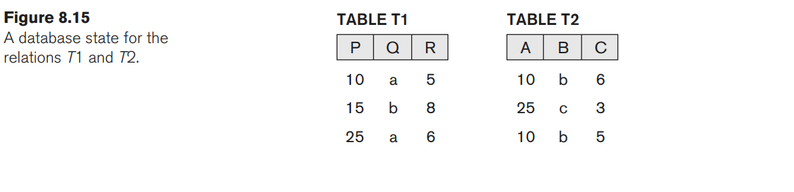
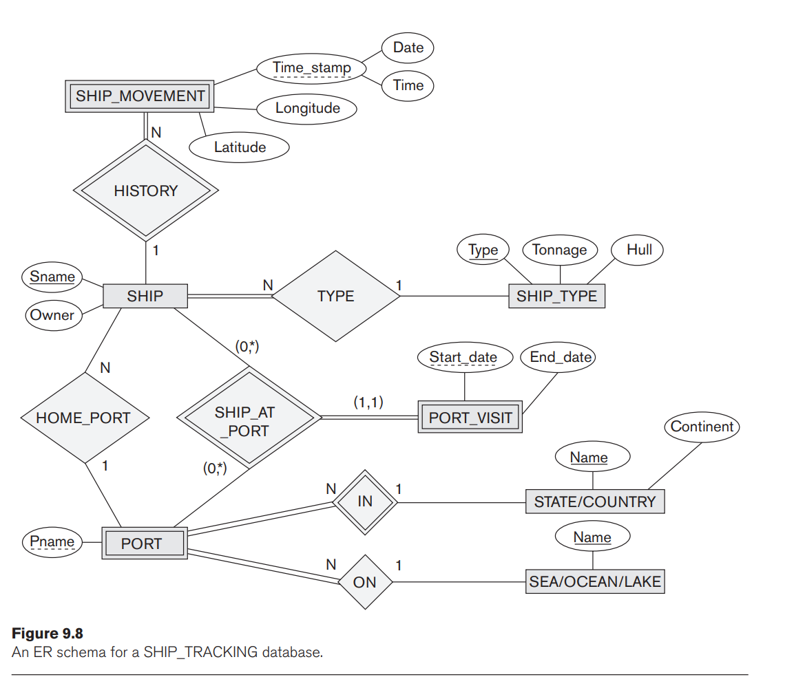

# Database Systems Homework 02

> NTUST Course Project  
> Course No: `CS3010301`  
> Course Name: Database Systems  
> Author: Hayden Chang 張皓鈞 B11030202  
> Email: B11030202@mail.ntust.edu.tw

## 1. Exercise 5.12

### Question

Consider the AIRLINE relational database schema shown in Figure 5.8, which describes a database for airline flight information. Each FLIGHT is identified by a Flight number, and consists of one or more FLIGHT_LEGs with Leg_numbers 1, 2, 3, and so on. Each FLIGHT_LEG has scheduled arrival and departure times, airports, and one or more LEG_INSTANCEs— one for each Date on which the flight travels. FAREs are kept for each FLIGHT. For each FLIGHT_LEG instance, SEAT_RESERVATIONs are kept, as are the AIRPLANE used on the leg and the actual arrival and departure times and airports. An AIRPLANE is identified by an Airplane_id and is of a particular AIRPLANE_TYPE. CAN_LAND relates AIRPLANE_TYPEs to the AIRPORTs at which they can land. An AIRPORT is identified by an Airport_code. Consider an update for the AIRLINE database to introduce a new leg instance tuple in the LEG_INSTANCE relation.

- **a.** Give the operations for this update.
- **b.** What types of constraints would you expect to check?
- **c.** Which integrity constraints should be checked to insert a new flight leg tuple into the FLIGHT_LEG relation not?
- **d.** Specify all the referential integrity constraints that hold on the schema shown in Figure 5.8.


### Answer


## 2. Exercise 5.17

### Question

Consider the following relations for a database that keeps track of booking of apartments by a constructor. (OPTION refers to some specific optional requirements/designs stated by the client to be implemented in the flat):

```
APARTMENT(Apartment#, Model, Address, Price_perSquareFt)
OPTION(Apartment#, Option_name, Extra_price)
BOOKING(Agent_id, Apartment#, Date, Booking_price)
AGENT(Agent_id, Name, Phone)
```

First, specify the foreign keys for this schema, stating any assumptions you make. Next, populate the relations with a few sample tuples, and then give an example of an insertion in the BOOKING and AGENT relations that violates the referential integrity constraints and of another insertion that does not.

### Answer


## 3. Exercise 8.15

### Question

Show the result of each of the sample queries in Section 8.5 as it would apply to the database state in Figure 5.6.

- **Query 1.** Retrieve the name and address of all employees who work for the `Research` department.
- **Query 2.** For every project located in `Stafford`, list the project number, the controlling department number, and the department manager’s last name, address, and birth date.
- **Query 3.** Find the names of employees who work on all the projects controlled by department number 5.
- **Query 4.** Make a list of project numbers for projects that involve an employee whose last name is `Smith`, either as a worker or as a manager of the department that controls the project.
- **Query 5.** List the names of all employees with two or more dependents.
- **Query 6.** Retrieve the names of employees who have no dependents.
- **Query 7.** List the names of managers who have at least one dependent.


### Answer


## 4. Exercise 8.17

### Question

Consider the AIRLINE relational database schema shown in Figure 5.8, which was described in Exercise 5.12. Specify the following queries in relational algebra:

- **a.** For each flight, list the flight number, airline, date, departure airport and arrival airport alongwith the number of available seats, for each leg.
- **b.** For all the airplane types available in the database, list the airplane type, name of the company, maximum seats available and the airports (or airport codes) where these planes can land.
- **c.** List the name, seat number and phone numbers of all the customers of all flights or flight legs that departed from Houston Intercontinental Airport (airport code `iah`) and arrived in Los Angeles International Airport (airport code `lax`) on `2016-03-16`.
- **d.** List fare information for all the flights run by the airline `Delta Airlines`.
- **e.** Retrieve the number of available seats onall flights run by Delta Airline, on `2016-04-09`.


### Answer


## 5. Exercise 8.22

### Question

Consider the two tables T1 and T2 shown in Figure 8.15. Show the results of the following operations:

- **a.** $T1 \bowtie_{T1.P = T2.A} T2$
- **b.** $T1 \bowtie_{T1.Q = T2.B} T2$
- **c.** $T1 ⟕_{T1.P = T2.A} T2$
- **d.** $T1 ⟖_{T1.Q = T2.B} T2$
- **e.** $T1 \cup T2$



### Answer


## 6. Exercise 8.25

### Question

Specify queries a, b, c, and d of Exercise 8.17 in both tuple and domain relational calculus.

**8.17 queries**

- **a.** For each flight, list the flight number, airline, date, departure airport and arrival airport alongwith the number of available seats, for each leg.
- **b.** For all the airplane types available in the database, list the airplane type, name of the company, maximum seats available and the airports (or airport codes) where these planes can land.
- **c.** List the name, seat number and phone numbers of all the customers of all flights or flight legs that departed from Houston Intercontinental Airport (airport code `iah`) and arrived in Los Angeles International Airport (airport code `lax`) on `2016-03-16`.
- **d.** List fare information for all the flights run by the airline `Delta Airlines`.


### Answer


## 7. Exercise 8.30

### Question

Show how you can specify the following relational algebra operations in both tuple and domain relational calculus.

- **a.** $\sigma_{A=C}(R(A, B, C))$
- **c.** $R(A, B, C) * S(C, D, E)$
- **d.** $R(A, B, C) \cup S(A, B, C)$
- **f.** $R(A, B, C) = S(A, B, C)$
- **g.** $R(A, B, C) \times S(D, E, F)$

### Answer


## 8. Exercise 9.4

### Question

Figure 9.8 shows an ER schema for a database that can be used to keep track of transport ships and their locations for maritime authorities. Map this schema into a relational schema and specify all primary keys and foreign keys.



### Answer

