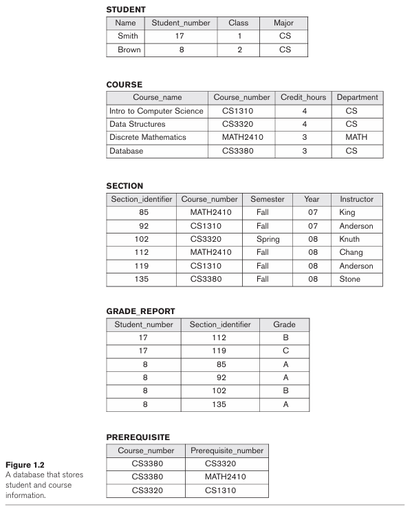
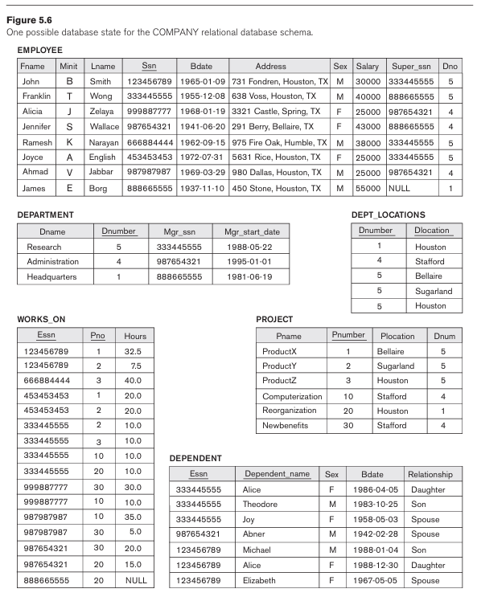
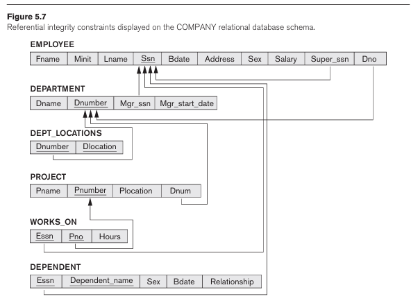
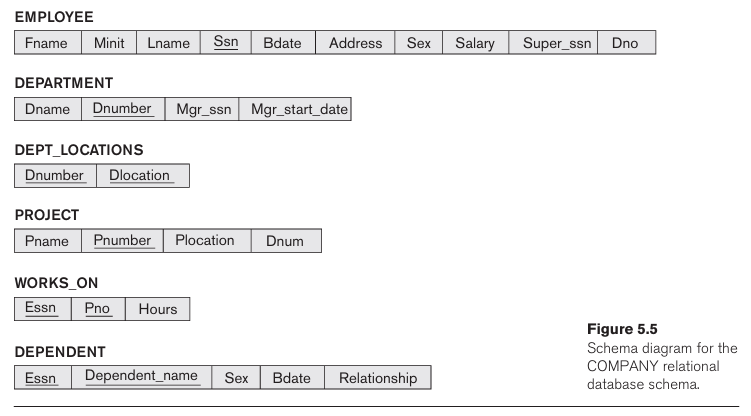

# Database Systems Homework 03

> NTUST Course Project  
> Course No: `CS3010301`  
> Course Name: Database Systems  
> Author: Hayden Chang 張皓鈞 B11030202  
> Email: B11030202@mail.ntust.edu.tw

> For exercises 6.10, 6.12, and 7.5, put the SQL results into the corresponding tables in your DB account. For example, put the query result of exercise 6.12 (a) in a table named “**6_12_a**” in your DB account.

## 1.

Consider the database shown in Figure 1.2, and write appropriate SQL DDL statements to create the database shown in Figure 1.2 in your DB account.



### Answer

```sql
CREATE TABLE STUDENT (
    Name VARCHAR(20) NOT NULL, 
    Student_number INT NOT NULL, 
    Class INT NOT NULL, 
    Major VARCHAR(10) NOT NULL, 
    PRIMARY KEY(Student_number) 
);

CREATE TABLE COURSE ( 
    Course_name VARCHAR(60) NOT NULL, 
    Course_number VARCHAR(10) NOT NULL, 
    Credit_hours INT NOT NULL, 
    Department VARCHAR(10) NOT NULL, 
    PRIMARY KEY(Course_number) 
);

CREATE TABLE SECTION ( 
    Section_identifier INTEGER NOT NULL, 
    Course_number VARCHAR(10) NOT NULL, 
    Semester VARCHAR(10) NOT NULL, 
    Year INT(2) NOT NULL, 
    Instructor VARCHAR(15) NOT NULL, 
    PRIMARY KEY(Section_identifier), 
    FOREIGN KEY(Course_number) REFERENCES COURSE(Course_number) 
);

CREATE TABLE GRADE_REPORT ( 
    Student_number INT NOT NULL, 
    Section_identifier INT NOT NULL, 
    Grade CHAR(1) NOT NULL, 
    PRIMARY KEY(Student_number, Section_identifier), 
    FOREIGN KEY(Student_number) REFERENCES STUDENT(Student_number), 
    FOREIGN KEY(Section_identifier) REFERENCES SECTION(Section_identifier)
);

CREATE TABLE PREREQUISITE ( 
    Course_number VARCHAR(10) NOT NULL, 
    Prerequisite_number VARCHAR(10) NOT NULL, 
    PRIMARY KEY(Course_number, Prerequisite_number), 
    FOREIGN KEY(Course_number) REFERENCES COURSE(Course_number), 
    FOREIGN KEY(Prerequisite_number) REFERENCES COURSE(Course_number)
);
```


## 2.

Consider the database shown in Figure 5.6, whose schema is shown in Figure 5.7. Write appropriate SQL DDL statements to create the database shown in Figure 5.6 in your DB account.





### Answer

```sql
CREATE TABLE EMPLOYEE (
    Fname VARCHAR(15) NOT NULL,
    Minit CHAR,
    Lname VARCHAR(15) NOT NULL,
    Ssn CHAR(9) NOT NULL,
    Bdate DATE,
    Address VARCHAR(50),
    Sex CHAR,
    Salary INT,
    Super_ssn CHAR(9),
    Dno INT NOT NULL,
    PRIMARY KEY(Ssn)
);

CREATE TABLE DEPARTMENT (
    Dname VARCHAR(15) NOT NULL,
    Dnumber INT NOT NULL,
    Mgr_ssn CHAR(9) NOT NULL,
    Mgr_start_date DATE,
    PRIMARY KEY(Dnumber),
    UNIQUE(Dname)
);

CREATE TABLE DEPT_LOCATIONS ( 
    Dnumber INT NOT NULL, 
    Dlocation VARCHAR(15) NOT NULL, 
    PRIMARY KEY(Dnumber, Dlocation), 
    FOREIGN KEY(Dnumber) REFERENCES DEPARTMENT(Dnumber) 
);

CREATE TABLE PROJECT ( 
    Pname VARCHAR(15) NOT NULL, 
    Pnumber INT NOT NULL, 
    Plocation VARCHAR(15), 
    Dnum INT NOT NULL, 
    PRIMARY KEY(Pnumber), 
    UNIQUE(Pname), 
    FOREIGN KEY(Dnum) REFERENCES DEPARTMENT(Dnumber) 
);

CREATE TABLE WORKS_ON ( 
    Essn CHAR(9) NOT NULL, 
    Pno INT NOT NULL, 
    Hours DECIMAL(3,1), 
    PRIMARY KEY(Essn, Pno), 
    FOREIGN KEY(Essn) REFERENCES EMPLOYEE(Ssn), 
    FOREIGN KEY(Pno) REFERENCES PROJECT(Pnumber) 
);

CREATE TABLE DEPENDENT ( 
    Essn CHAR(9) NOT NULL, 
    Dependent_name VARCHAR(15) NOT NULL, 
    Sex CHAR, 
    Bdate DATE, 
    Relationship VARCHAR(8), 
    PRIMARY KEY(Essn, Dependent_name), 
    FOREIGN KEY(Essn) REFERENCES EMPLOYEE(Ssn) 
);

ALTER TABLE EMPLOYEE
    ADD FOREIGN KEY (Dno) REFERENCES DEPARTMENT(Dnumber),
    ADD FOREIGN KEY (Super_ssn) REFERENCES EMPLOYEE(Ssn);

ALTER TABLE DEPARTMENT
    ADD FOREIGN KEY (Mgr_ssn) REFERENCES EMPLOYEE(Ssn);
```


## 3. Exercise 6.10

Specify the following queries in SQL on the COMPANY relational database schema shown in Figure 5.5. Show the result of each query if it is applied to the COMPANY database in Figure 5.6.

- **a.** Retrieve the names of all employees in department 5 who earns more than 3000 and works on ProductZ project.
- **b.** List the names of all employees who are from Houston, Texas and works under manager 333445555.
- **c.** Find the names of all employees who are working in the project Computerisation.




### Answer

- **a.**

  ```sql
  SELECT
  	E.Fname,
  	E.Minit,
  	E.Lname
  FROM
  	EMPLOYEE E,
  	WORKS_ON W,
  	PROJECT P
  WHERE
  	E.Ssn = W.Essn
  	AND W.Pno = P.Pnumber
  	AND E.Dno = 5
  	AND P.Pname = 'ProductZ'
  	AND E.Salary > 3000
  ```

  | Fname    | Minit | Lname   |
  | -------- | ----- | ------- |
  | Franklin | T     | Wong    |
  | Ramesh   | K     | Narayan |

- **b.**

  ```sql
  SELECT
  	Fname,
  	Minit,
  	Lname
  FROM
  	EMPLOYEE,
  	DEPARTMENT
  WHERE
  	Address LIKE '%Houston, TX'
  	AND Dno = Dnumber
  	AND Mgr_ssn = '333445555'
  ```

  | Fname    | Minit | Lname   |
  | -------- | ----- | ------- |
  | John     | B     | Smith   |
  | Franklin | T     | Wong    |
  | Joyce    | A     | English |

- **c.**

  ```sql
  SELECT
  	E.Fname,
  	E.Minit,
  	E.Lname
  FROM
  	EMPLOYEE E,
  	WORKS_ON W,
  	PROJECT P
  WHERE
  	E.Ssn = W.Essn
  	AND W.Pno = P.Pnumber
  	AND P.Pname = 'Computerization'
  ```

  | Fname    | Minit | Lname  |
  | -------- | ----- | ------ |
  | Franklin | T     | Wong   |
  | Ahmad    | V     | Jabbar |
  | Alicia   | J     | Zelaya |


## 4. Exercise 6.11

> specify the updates of Exercise 5.11 using the SQL update commands

Suppose that each of the following Update operations is applied directly to the database state shown in Figure 5.6. Discuss all integrity constraints violated by each operation, if any, and the different ways of enforcing these constraints.

- **a.** Insert <'Sophia', 'M', 'Wood', '973442298', '1974-05-21', '23 S Lamar Blvd. Rd, Austin, TX, 'F, 62000, 222445555, 5> into EMPLOYEE.
- **b.** Insert <'6Sigma', 4, 'Austin', 4> into PROJECT.
- **c.** Insert < 'Information Technology', 2, 987987987', '2007-10-01'> into DEPARTMENT.
- **d.** Insert <777624972', 15, '40.0' > into WORKS_ON.
- **e.** Insert <'888665555', 'John', 'M', null, 'Son' > into DEPENDENT.
- **f.** Delete the DEPENDENT tuples with Essn = 987654321'.
- **g.** Delete the DEPARTMENT tuples with Dnumber = 5.
- **h.** Delete the WORKS_ON tuples with Pnoe = 30.
- **i.** Modify the Plocation and Dnum of the PROJECT tuples with Dnum = 5 to 'Houston' and 1, respectively.
- **j.** Modify the Super_ssn attribute of the EMPLOYEE tuple with Ssn = '888665555' to null.
- **k.** Modify the Pnumber attribute of the PROJECT tuple with Pnumber = 30 to 40

### Answer

- **a.**

  ```sql
  INSERT INTO EMPLOYEE
  		values('Sophia', 'M', 'Wood', '973442298', '1974-05-21', '23 S Lamar Blvd. Rd, Austin, TX', 'F', 62000, '222445555', 5)
  ```

  ```
  Query 1 ERROR at Line 3: : Cannot add or update a child row: a foreign key constraint fails (`db_B11030202`.`EMPLOYEE`, CONSTRAINT `EMPLOYEE_ibfk_2` FOREIGN KEY (`Super_ssn`) REFERENCES `EMPLOYEE` (`Ssn`))
  ```

- **b.**

  ```sql
  INSERT INTO PROJECT
  		values('6Sigma', 4, 'Austin', 5)
  ```

  ```
  Query 1 OK: 1 row affected
  ```

- **c.**

  ```sql
  INSERT INTO DEPARTMENT
  		values('Information Technology', 2, '987987987', '2007-10-01')
  ```

  ```
  Query 1 OK: 1 row affected
  ```

- **d.**

  ```sql
  INSERT INTO WORKS_ON
  		values('777624972', 15, 40.0)
  ```

  ```
  Query 1 ERROR at Line 3: : Cannot add or update a child row: a foreign key constraint fails (`db_B11030202`.`WORKS_ON`, CONSTRAINT `WORKS_ON_ibfk_1` FOREIGN KEY (`Essn`) REFERENCES `EMPLOYEE` (`Ssn`))
  ```

- **e.**

  ```sql
  INSERT INTO DEPENDENT
  		values('888665555', 'John', 'M', NULL, 'Son')
  ```

  ```
  Query 1 OK: 1 row affected
  ```

- **f.**

  ```sql
  DELETE FROM DEPENDENT
  WHERE Essn = '987654321'
  ```

  ```
  Query 1 OK: 1 row affected
  ```

- **g.**

  ```sql
  DELETE FROM DEPARTMENT
  WHERE Dnumber = 5
  ```

  ```
  Query 1 ERROR at Line 3: : Cannot delete or update a parent row: a foreign key constraint fails (`db_B11030202`.`DEPT_LOCATIONS`, CONSTRAINT `DEPT_LOCATIONS_ibfk_1` FOREIGN KEY (`Dnumber`) REFERENCES `DEPARTMENT` (`Dnumber`))
  ```

- **h.**

  ```sql
  DELETE FROM WORKS_ON
  WHERE Pnoe = 30
  ```

  ```
  Query 1 ERROR at Line 3: : Unknown column 'Pnoe' in 'where clause'
  ```

- **i.**

  ```sql
  UPDATE
  	PROJECT
  SET
  	Plocation = 'Houston',
  	Dnum = 1
  WHERE
  	Dnum = 5
  ```

  ```
  Query 1 OK: 4 rows affected
  ```

- **j.**

  ```sql
  UPDATE
  	EMPLOYEE
  SET
  	Super_ssn = NULL
  WHERE
  	Ssn = '888665555'
  ```

  ```
  Query 1 OK: 0 rows affected
  ```

- **k.**

  ```sql
  UPDATE
  	PROJECT
  SET
  	Pnumber = 40
  WHERE
  	Pnumber = 30
  ```

  ```
  Query 1 ERROR at Line 3: : Cannot delete or update a parent row: a foreign key constraint fails (`db_B11030202`.`WORKS_ON`, CONSTRAINT `WORKS_ON_ibfk_2` FOREIGN KEY (`Pno`) REFERENCES `PROJECT` (`Pnumber`))
  ```

## 5. Exercise 6.12

Specify the following queries in SQL on the database schema of Figure 1.2.

- **a.** Retrieve the course names of all the courses that comes under the department of 'cs' (computer science).
- **b.** Retrieve the names of all courses along with the name of the instructor taught during the fall of 2008.
- **c.** For each section taught by Professor Anderson, retrieve the course num-ber, semester, year, and number of students who took the section.
- **d.** Retrieve the name and transcript of each junior student (Class = 1) majoring in mathematics (MATH). A transcript includes course name, course number, credit hours, semester, year, and grade for each course completed by the student.


### Answer

- **a.**

  ```sql
  SELECT
  	Course_name
  FROM
  	COURSE
  WHERE
  	Department = 'CS'
  ```

  | Course_name               |
  | ------------------------- |
  | Intro to Computer Science |
  | Data Structures           |
  | Database                  |

- **b.**

  ```sql
  SELECT
  	c.Course_name,
  	s.Instructor
  FROM
  	COURSE AS c,
  	SECTION AS s
  WHERE
  	c.Course_number = s.Course_number
  	AND s.Semester = 'Fall'
  	AND s.Year = '08'
  ```

  | Course_name               | Instructor |
  | ------------------------- | ---------- |
  | Discrete Mathematics      | Chang      |
  | Intro to Computer Science | Anderson   |
  | Database                  | Stone      |

- **c.**

  ```sql
  SELECT
  	S.Course_number,
  	S.Semester,
  	S.Year,
  	COUNT(*)
  FROM
  	SECTION AS S,
  	GRADE_REPORT AS G
  WHERE
  	S.Section_identifier = G.Section_identifier
  	AND S.Instructor = 'Anderson'
  GROUP BY
  	S.Course_Number,
  	S.Semester,
  	S.Year
  ```

  | Course_number | Semester | Year | COUNT(*) |
  | ------------- | -------- | ---- | -------- |
  | CS1310        | Fall     | 7    | 1        |
  | CS1310        | Fall     | 8    | 1        |

- **d.**

  ```sql
  SELECT
  	STU.Name,
  	C.Course_Name,
  	C.Course_number,
  	C.Credit_Hours,
  	S.Semester,
  	S.YEAR,
  	G.GRADE
  FROM
  	STUDENT AS STU,
  	COURSE AS C,
  	SECTION AS S,
  	GRADE_REPORT AS G
  WHERE
  	STU.Class = 1
  	AND STU.Major = 'MATH'
  	AND STU.Student_Number = G.Student_Number
  	AND G.Section_identifier = S.Section_identifier
  	AND S.Course_Number = C.Course_number
  ```

  | Name | Course_Name | Course_number | Credit_Hours | Semester | YEAR | GRADE |
  | ---- | ----------- | ------------- | ------------ | -------- | ---- | ----- |
  |      |             |               |              |          |      |       |


## 6. Exercise 6.13

Write SQL update statements to do the following on the database schema shown in Figure 1.2.

- **a.** Insert a new course, ‹'Financial Accounting, 'fac4390', 5, 'BUSINESS'>.
- **b.** Insert a new section, <145, 'fac4390', 'Fall', '17', 'Hanif'>.
- **c.** Insert a new student, <'Robin', 34, 3, 'BUSINESS'>.
- **d.** Update the record for the student whose student number is 17 and change his class from 1 to 3.


### Answer

- **a.**

  ```sql
  INSERT INTO COURSE
  		VALUES('Financial Accounting', 'fac4390', 5, 'BUSINESS');
  ```

  ```
  Query 1 OK: 1 row affected
  ```

- **b.**

  ```sql
  INSERT INTO SECTION
  		VALUES(145, 'fac4390', 'Fall', 'Hanif');
  ```

  ```
  Query 1 OK: 0 rows affected
  ```

- **c.**

  ```sql
  INSERT INTO STUDENT
  		VALUES('Robin', 34, 3, 'BUSINESS');
  ```

  ```
  Query 1 OK: 1 row affected
  ```

- **d.**

  ```sql
  UPDATE
  	STUDENT
  SET
  	Class = 3
  WHERE
  	Student_number = 17
  	AND Class = 1
  ```

  ```
  Query 1 OK: 1 row affected
  ```

## 7. Exercise 7.5

Specify the following queries on the database in Figure 5.5 in SQL. Show the query results if each query is applied to the database state in Figure 5.6.

- **a.** For each department whose average employee salary is more than $30,000, retrieve the department name and the number of employees working for that department.
- **b.** Suppose that we want the number of male employees in each department making more than $30,000, rather than all employees (as in Exercise 7.5a). Can we specify this query in SQL? Why or why not?


### Answer

- **a.**

  ```sql
  SELECT
  	Dname,
  	COUNT(*) AS WORKECOUNT
  FROM
  	DEPARTMENT,
  	EMPLOYEE
  WHERE
  	DNUMBER = DNO
  GROUP BY
  	Dname
  HAVING
  	AVG(SALARY) > 30000
  ```

  | Dname          | WORKECOUNT |
  | -------------- | ---------- |
  | Research       | 4          |
  | Headquarters   | 1          |
  | Administration | 3          |

- **b.**

  ```sql
  SELECT
  	Dname,
  	COUNT(*) AS WORKECOUNT
  FROM
  	DEPARTMENT,
  	EMPLOYEE
  WHERE
  	DNUMBER = DNO
  	AND SEX = 'M'
  	AND DNO IN(
  		SELECT
  			DNO FROM EMPLOYEE
  		GROUP BY
  			DNO
  		HAVING
  			AVG(SALARY) > 30000)
  GROUP BY
  	Dname
  ```

  | Dname          | WORKECOUNT |
  | -------------- | ---------- |
  | Research       | 3          |
  | Headquarters   | 1          |
  | Administration | 1          |

